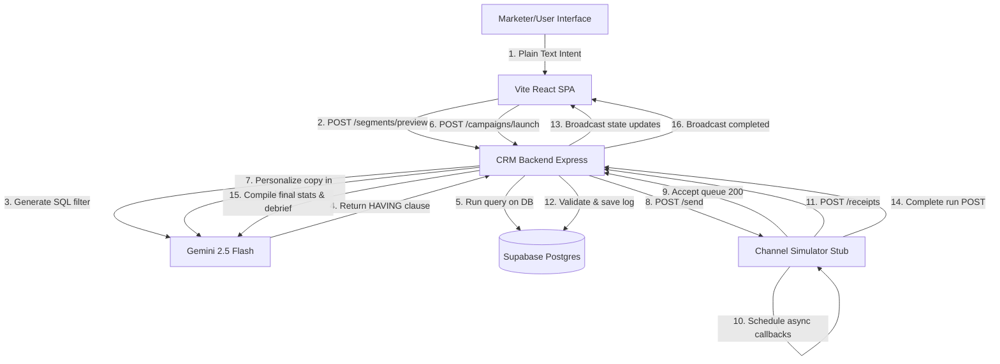

# Xeno Mini CRM Monorepo

Intelligent, AI-native Mini CRM for retail & D2C brands, featuring automated audience segmentation, personalized messaging, real-time message delivery simulation, and campaign analytics feedback loops.

---

## Technical Architecture

The system comprises three primary layers:
1. **Frontend (`apps/frontend`):** A single-page application built on Vite, React, and TypeScript. Leverages Recharts for interactive lifecycle and funnel analytics, connects to the backend WebSocket stream for real-time campaign counts, and enforces styling constraints from `theme.ts`.
2. **CRM Backend (`apps/crm-backend`):** An Express server managing REST endpoints, PostgreSQL connections, WebSocket channels, and external client requests.
3. **Channel Simulator (`apps/channel-stub`):** A separate Node.js service simulating message pipelines (WhatsApp, SMS, Email, RCS) with custom delays, probability rollbacks (open rates, click rates, conversion rates), and network retries.

---

## Explicit Tradeoffs

| Decision | What I did | What I'd do at scale |
|---|---|---|
| **Async queue** | `setTimeout` queues in channel simulator memory. | Production-grade brokers (e.g., BullMQ, RabbitMQ, SQS) with dead-letter queueing. |
| **Database** | Direct PG pool connection to a single Supabase cloud instance. | Connection pooling (PgBouncer), read replicas, and write-heavy partitioning. |
| **AI calls** | Parallel API batches of 30 items per request to Gemini 2.5 Flash. | Background worker queue, token usage rate-limit throttling, and query caching. |
| **WebSocket** | Standard `ws` package attached to the Express HTTP handler. | Scalable standalone socket instances (e.g. Socket.io, AWS API Gateway WebSockets, Redis Adapter). |
| **Authentication** | Open development endpoints without routing guards. | Auth0, JWT authorization tokens, and row-level security policy mappings. |
| **Message batching** | Static batching chunks of 30. | Dynamic token-length aware batching matching models' context constraints. |

---

## AI Workflow

This workspace was scaffolded and constructed end-to-end using **Antigravity**, an agentic AI coding companion designed by Google DeepMind.
- Core schema designs, router states, and component bindings were created step-by-step.
- AI interactions use the Google Gen AI SDK (`@google/genai`) to run target analysis and personalized marketing generation on **Gemini 2.5 Flash**.
- Progress was tracked using a `task.md` checklist at each milestone, followed by atomic Git commits to maintain an active audit history.
